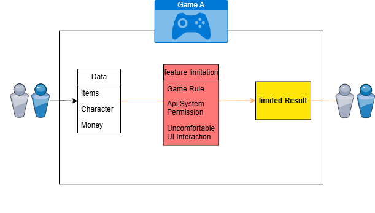
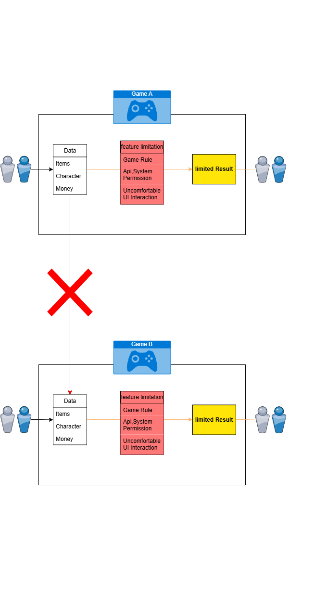
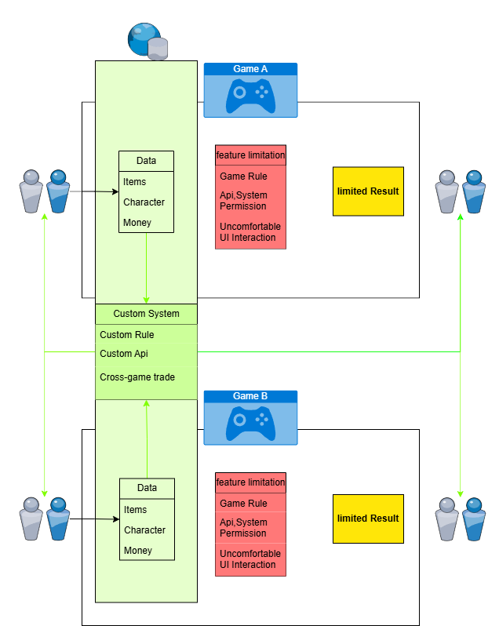

# SnowMuffin Game Hub:

**SnowMuffin Game Hub:**는 여러 게임 관련 서비스 및 데이터를 연결하는 중심 허브 역할을 하는 프로젝트입니다. 각 게임 및 시스템별로 별도의 프론트엔드를 통해 다양한 상호작용이 가능하며, 게임 간 데이터 교환을 통해 유저 경험을 확장하는 것을 목표로 합니다.

## 문제 정의

### 기존 유저의 인게임 상호작용의 한계

대부분의 게임은 고유한 시스템에 의해 데이터가 움직이며, 이러한 시스템에서 유저가 선택할 수 있는 옵션은 보안 및 안정성 등의 이유로 인해 많은 제약을 받습니다. 결과적으로 유저들은 게임 내에서 제공되는 제한적인 상호작용에만 의존할 수밖에 없으며, 이는 게임 경험의 깊이와 다양성을 제한합니다.

### 기존 게임 간 상호작용의 부재

기존에는 서로 다른 게임 간에 데이터 교환이 이루어지지 않았습니다. 여러 샌드박스 게임에는 다양한 자원이 존재하지만, 각 게임의 자원을 모두 모으고 즐기기 위해서는 시간과 효율성에 많은 문제가 발생합니다. 이는 다양한 게임을 플레이하고자 하는 유저들에게 불편함을 초래하고, 자원의 활용 가능성을 제한합니다.

## 프로젝트 개요

이러한 문제를 해결하기 위해 **SnowMuffin Game Hub:** 프로젝트를 기획했습니다. 이 프로젝트는 다음과 같은 목표를 가지고 있습니다:

1. **게임 데이터들의 응집**: 게임 내 데이터를 외부 시스템으로 일부 이식하여 허브 서버에서 직접 상호작용과 거래를 구성할 수 있도록 합니다. 이를 통해 게임 내 데이터의 활용도를 높이고, 유저들이 새로운 방식으로 게임을 경험할 수 있게 합니다.

2. **중심 허브로서의 역할**: 다양한 게임과 서비스의 데이터를 SnowMuffin Game Hub:에 통합함으로써, 중심 허브에서 모든 상호작용을 관리하고 조율합니다. 이를 통해 유저가 게임 간 데이터를 자유롭게 교환하거나, 여러 게임에 걸쳐 상호작용할 수 있습니다.

3. **다양한 서비스 및 시스템 통합**: SnowMuffin Game Hub:는 게임 간 상호작용 외에도 다른 서비스나 시스템을 허브에 연결하여 유저 경험을 확장합니다. 예를 들어, 리소스를 거래하거나 특별한 이벤트를 진행하는 등 새로운 콘텐츠를 추가할 수 있습니다.

## 주요 기능

- **게임 간 데이터 통합**: 서로 다른 게임 간에 자원과 데이터를 교환할 수 있는 기능을 제공하여, 유저가 게임을 더 효율적으로 플레이할 수 있도록 합니다.
- **중앙화된 거래 시스템**: 허브 서버에서 모든 자원의 거래와 상호작용을 관리하여, 유저가 다양한 게임에서 얻은 자원을 한곳에서 거래하고 활용할 수 있게 합니다.
- **확장 가능한 서비스 구조**: SnowMuffin Game Hub:는 확장 가능한 구조를 갖추고 있어, 새로운 게임이나 서비스를 쉽게 추가하고 통합할 수 있습니다.

## 현재 연결된 프로젝트

### SEK_SERVER
- **Frontend provided by Nicola**  
  Nicola님이 제공한 프론트엔드로 구성된 SEK_SERVER 프로젝트입니다. 이 프로젝트는 SnowMuffin Game Hub:의 일부로, 유저가 게임 내외에서 상호작용하고 경험을 확장할 수 있는 기능을 제공합니다. SEK_SERVER는 SnowMuffin Game Hub:와 연동되어 중앙 허브의 기능을 통해 게임 데이터를 교환하고 상호작용할 수 있는 시스템을 구현하고 있습니다.

## 향후 계획

- **다양한 게임과 서비스 통합**: 더 많은 게임과 시스템을 SnowMuffin Game Hub:에 연결하여, 허브의 기능을 확장하고 유저들이 더 많은 게임에서 통합된 경험을 누릴 수 있도록 할 계획입니다.
- **유저 경험의 확장**: 게임 내외에서 제공되는 기능을 통해 유저가 게임을 플레이하면서 얻는 보상을 현실 세계의 다른 서비스나 다른 게임으로 확장할 수 있는 다양한 방법을 모색하고 있습니다.
- **자동화된 상호작용**: 유저 간 거래 및 상호작용을 자동화하여, 관리자의 개입 없이도 원활하게 운영될 수 있는 시스템을 구축할 예정입니다.

---

